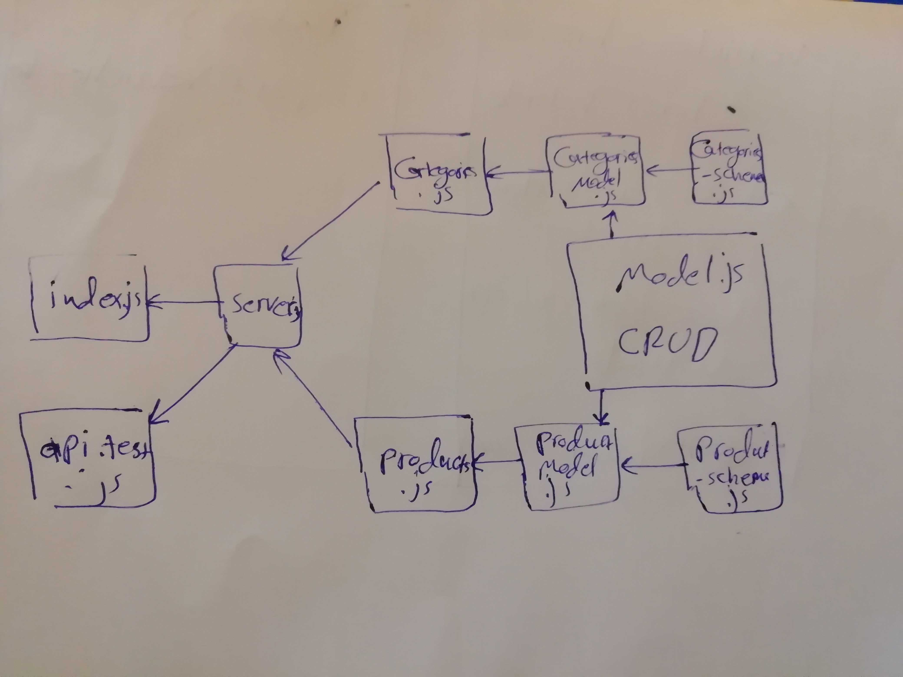

# LAB - Class 08

## Express Routing & Connected API

### Author: Ibrahim/Naseem/Obada

### Links and Resources
- [submission PR](https://github.com/naseem-401-advanced-javascript/lab-08/tree/express-routing-connected-api)
- [ci/cd]() (GitHub Actions)
### Setup

#### `.env` requirements (where applicable)
- `PORT` - 3000
- `MONGODB_URI` - mongodb://localhost:27017/store

#### How to initialize/run your application (where applicable)
-`npm start`

#### Tests
- How do you run tests?
`npm run test`
- Any tests of note?
nope
- Describe any tests that you did not complete, skipped, etc

#### UML
